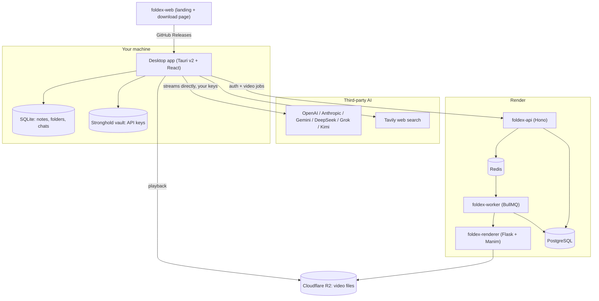
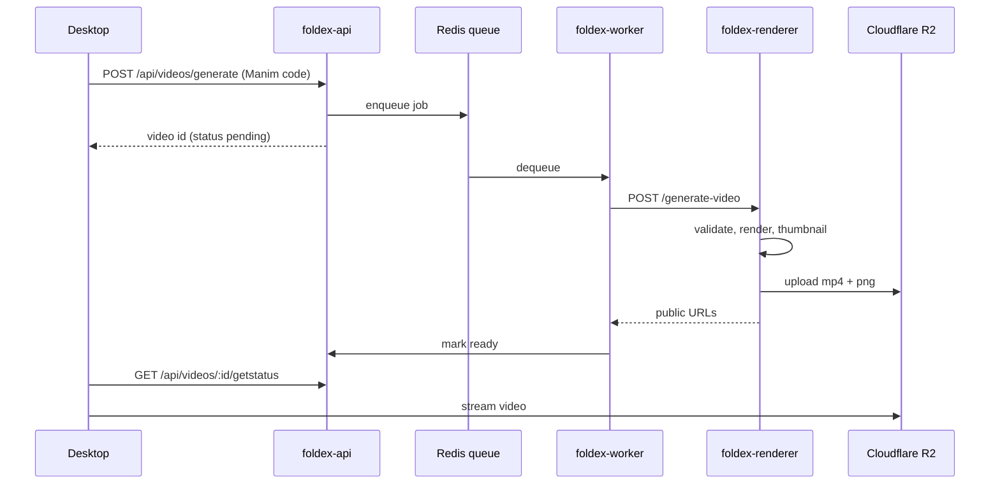

# foldex

**A local-first desktop app for notes, folders, and AI-assisted study. Bring your own AI models. Free and open source.**

foldex is a self-directed learning workspace. Your notes live on your machine in a local SQLite database, the editor is block-based and extensible, and every AI feature runs against **your** API keys instead of a subscription we resell. It started as a school project and is built in the open.

- Website: [foldex.space](https://foldex.space)
- Download: [foldex.space/download](https://foldex.space/download)
- Discord: [discord.gg/bMHfCXz6bv](https://discord.gg/bMHfCXz6bv)

---

## Table of contents

- [Highlights](#highlights)
- [Architecture](#architecture)
- [Repository layout](#repository-layout)
- [Tech stack](#tech-stack)
- [Getting started](#getting-started)
  - [Prerequisites](#prerequisites)
  - [1. Clone and install](#1-clone-and-install)
  - [2. Configure environment variables](#2-configure-environment-variables)
  - [3. Start local infrastructure](#3-start-local-infrastructure)
  - [4. Apply database migrations](#4-apply-database-migrations)
  - [5. Run the apps](#5-run-the-apps)
  - [Port map](#port-map)
- [The desktop app](#the-desktop-app)
  - [Editor blocks](#editor-blocks)
  - [AI providers and key storage](#ai-providers-and-key-storage)
  - [Local database](#local-database)
  - [Tabs and navigation](#tabs-and-navigation)
  - [Import and export](#import-and-export)
- [The backend API](#the-backend-api)
- [Video generation pipeline](#video-generation-pipeline)
- [Building and releasing the desktop app](#building-and-releasing-the-desktop-app)
  - [Local build](#local-build)
  - [Cutting a release](#cutting-a-release)
  - [Update signing keys](#update-signing-keys)
  - [How auto-updates work](#how-auto-updates-work)
- [Deployment](#deployment)
- [Monorepo tasks](#monorepo-tasks)
- [Troubleshooting](#troubleshooting)
- [Contributing](#contributing)
- [License](#license)

---

## Highlights

**Local-first by default.** Notes, folders, chats, and settings are stored in a SQLite database on your device. The app is fully usable offline and without an account — guest mode writes to the same local database, and signing in only adds cloud features.

**Block-based editor.** Built on [BlockNote](https://www.blocknotejs.org/) with custom blocks for Mermaid diagrams, LaTeX math, syntax-highlighted code, YouTube embeds, AI-generated quizzes, AI-generated flashcards, and inline AI explainer videos.

**Bring your own AI.** Add keys for OpenAI, Anthropic, Google Gemini, DeepSeek, xAI Grok, or Moonshot Kimi and switch between them freely. Keys are encrypted at rest in a [Tauri Stronghold](https://v2.tauri.app/plugin/stronghold/) vault; only a masked hint and a validity flag are kept in SQLite. AI calls stream directly from your machine to the provider — they do not pass through our servers.

**AI that acts on your workspace.** The assistant can create and update notes and folders, search the web (via Tavily), search YouTube, emit code and diagrams, and generate videos. A split canvas panel renders results next to the conversation.

**Attachment understanding.** Drop in PDFs, DOCX, PPTX, images, or plain text. Parsing runs locally: `pdfjs` for PDFs, `mammoth` for DOCX, `jszip` for PPTX slide text, and `tesseract.js` OCR for images.

**AI explainer videos.** Describe a concept and a Python [Manim](https://www.manim.community/) service renders a narrated animation, uploads it to Cloudflare R2, and streams it back into the app. Videos can be kept private or published to a shared "video vault".

**Tabbed workspace.** Notes and videos open in reorderable tabs (up to 15) that survive restarts, alongside a drag-and-drop folder tree.

**Auto-updating.** Signed updates are published to GitHub Releases and installed from within the app.

---

## Architecture

foldex deliberately keeps the heavy lifting on the client. The server exists only for authentication and for work the desktop cannot do itself (rendering videos).



The key consequence: **your notes never leave your device**, and your AI keys never reach our infrastructure.

---

## Repository layout

A [Bun workspaces](https://bun.sh/docs/install/workspaces) monorepo orchestrated by [Turborepo](https://turbo.build/).

```
foldex/
├── apps/
│   ├── desktop/           # Tauri v2 desktop app (the product)
│   │   ├── src/           # React frontend
│   │   │   ├── components/
│   │   │   │   ├── notescomponent/    # BlockNote editor + custom blocks
│   │   │   │   ├── aicomponents/      # chat, canvas, model picker
│   │   │   │   ├── videos/            # generation modal, player, vault
│   │   │   │   ├── sidebarcomponents/ # icon rail, folder tree, DnD
│   │   │   │   ├── settingscomponents/
│   │   │   │   └── tabs/              # tab bar and tab content
│   │   │   ├── hooks/     # use-chat, use-settings, use-updater, ...
│   │   │   ├── lib/       # localdb, schema.local, providers, ai/
│   │   │   ├── routes/    # TanStack Router file routes
│   │   │   └── stores/    # zustand: tabs, notes, ai, canvas, settings
│   │   └── src-tauri/     # Rust shell, plugins, capabilities, bundle config
│   ├── web/               # Marketing site + OS-aware download page
│   ├── backend/           # Hono REST API, Better Auth, BullMQ worker
│   └── renderer/          # Python Flask + Manim video service
├── packages/
│   └── ui/                # Shared shadcn/ui component library (@workspace/ui)
├── .github/workflows/     # release-desktop.yml
├── render.yaml            # Render Blueprint for all hosted services
└── turbo.json
```

---

## Tech stack

| Area | Technology |
|---|---|
| Package manager | Bun 1.3.14 (workspaces) |
| Task runner | Turborepo |
| Desktop shell | Tauri v2 (Rust 1.77.2+) |
| UI | React 19, TanStack Start, TanStack Router, Tailwind CSS v4, shadcn/ui |
| Client state | Zustand (UI state), TanStack Query (async state) |
| Editor | BlockNote with custom block specs |
| Local storage | SQLite via `@tauri-apps/plugin-sql`, Drizzle ORM (sqlite-proxy) |
| Secret storage | Tauri Stronghold |
| AI | Vercel AI SDK v6, streamed client-side |
| API | Hono, consumed by the desktop app over Hono RPC |
| Server database | PostgreSQL 16 + Drizzle ORM |
| Auth | Better Auth (passwordless OTP) with Resend for email |
| Queue | BullMQ on Redis (`noeviction`) |
| Video rendering | Python, Flask, Manim 0.19, manim-voiceover, Google Cloud TTS |
| Object storage | Cloudflare R2 (S3-compatible, via boto3) |
| Hosting | Render Blueprint |

---

## Getting started

### Prerequisites

| Requirement | Needed for | Notes |
|---|---|---|
| [Bun](https://bun.sh) >= 1.3.14 | everything | The repo pins `bun@1.3.14` |
| [Rust](https://rustup.rs) >= 1.77.2 | desktop app | Only if you build or run the desktop shell |
| [Docker](https://www.docker.com) | backend | Local PostgreSQL and Redis |
| Python 3.12 + `ffmpeg` | video renderer | Optional; only for the Manim service |
| [Resend](https://resend.com) account | backend auth | OTP sign-in emails |

**Linux desktop builds** additionally need the WebKitGTK development headers. On Debian/Ubuntu:

```bash
sudo apt-get update && sudo apt-get install -y \
  libwebkit2gtk-4.1-dev build-essential curl wget file libssl-dev \
  libayatana-appindicator3-dev librsvg2-dev patchelf xdg-utils
```

Tauri v2 requires WebKitGTK **4.1** — the older 4.0 package will not work.

### 1. Clone and install

```bash
git clone https://github.com/kerry883/foldex.git
cd foldex
bun install
```

One install at the root covers every workspace.

### 2. Configure environment variables

Each app ships an example file. Copy the ones you need:

```bash
cp apps/desktop/.env.example  apps/desktop/.env
cp apps/backend/.env.example  apps/backend/.env
cp apps/renderer/.env.example apps/renderer/.env   # only for video rendering
```

**`apps/desktop/.env`**

| Variable | Purpose |
|---|---|
| `VITE_API_URL` | Base URL of the backend (`http://localhost:3000`) |
| `VITE_GOOGLE_SEARCH_API_KEY` | Optional; enables YouTube search in the AI assistant |

Provider API keys are **not** set here — you enter them in Settings > API Keys so they land in the encrypted vault.

**`apps/backend/.env`**

| Variable | Purpose |
|---|---|
| `DATABASE_URL` | PostgreSQL connection string |
| `REDIS_URL` | Redis connection string |
| `RESEND_API_KEY` | Sends OTP sign-in emails |
| `BETTER_AUTH_SECRET` | Session signing secret — generate with `openssl rand -base64 32` |
| `BETTER_AUTH_URL` | Public URL of this API |
| `FRONTEND_URL` | Allowed origin for CORS |
| `MANIM_FLASK_URL` | Renderer service URL (`http://localhost:5001`) |
| `PORT` | HTTP port |
| `COOKIE_DOMAIN` | Leave unset locally and on `*.onrender.com` |

**`apps/renderer/.env`**

| Variable | Purpose |
|---|---|
| `R2_ACCOUNT_ID`, `R2_ACCESS_KEY_ID`, `R2_SECRET_ACCESS_KEY` | Cloudflare R2 credentials |
| `R2_BUCKET_NAME`, `R2_PUBLIC_URL` | Bucket and its public base URL |
| `PORT` | HTTP port (default `5001`) |
| `GOOGLE_APPLICATION_CREDENTIALS` | Optional; Google Cloud TTS for voiceovers |

### 3. Start local infrastructure

```bash
cd apps/backend
docker compose up -d
```

This starts PostgreSQL 16 on `5432` and Redis 7 on `6379` with `--maxmemory-policy noeviction`, which BullMQ requires so queued jobs are never evicted.

### 4. Apply database migrations

```bash
cd apps/backend
bun run db:migrate
```

The API and worker also run pending migrations on boot, so this is mostly for a clean first setup. To author a new migration after editing `src/db/schema.ts`, run `bun run db:generate`.

### 5. Run the apps

The desktop app only needs the backend running if you want sign-in or video generation. For notes and AI chat, you can skip straight to the desktop app.

```bash
# Backend API (hot reload)
cd apps/backend && bun dev

# BullMQ worker — a separate process, required for video generation
cd apps/backend && bun run worker

# Desktop app (starts Vite, then the Tauri shell)
cd apps/desktop && bun run tauri:dev

# Landing site
cd apps/web && bun dev

# Video renderer (optional)
cd apps/renderer && pip install -r requirements.txt && python flask_api.py
```

### Port map

| Service | Port |
|---|---|
| `apps/backend` API | 3000 |
| `apps/web` dev server | 3000 |
| `apps/desktop` Vite dev server | 3001 |
| `apps/renderer` Flask | 5001 |
| PostgreSQL | 5432 |
| Redis | 6379 |

> **Note:** the backend and the landing site both default to port 3000. If you need to run them at the same time, change `PORT` in `apps/backend/.env` or pass `--port` to the web dev server, and update `VITE_API_URL` to match.

---

## The desktop app

### Editor blocks

Custom block specs are registered in [`apps/desktop/src/components/notescomponent/blocknote-editor.tsx`](apps/desktop/src/components/notescomponent/blocknote-editor.tsx), on top of all BlockNote defaults.

| Block | Description |
|---|---|
| `mermaid` | Mermaid diagram with live rendering and SVG download |
| `latex` | Standalone LaTeX math block (KaTeX) |
| `math` | Inline LaTeX, auto-converted from `$...$` |
| `codeBlock` | Syntax highlighting via Shiki |
| `youtubeVideo` | YouTube embed from a URL |
| `quiz` | Interactive quiz generated from your note |
| `flashcard` | Flashcard deck generated from your note |
| `aivideo` | Inline AI-generated Manim explainer video |

Markdown serialization for the custom types lives in [`blocknotehelper.ts`](apps/desktop/src/lib/blocknotehelper.ts).

### AI providers and key storage

Providers are declared in [`apps/desktop/src/lib/providers.ts`](apps/desktop/src/lib/providers.ts): OpenAI, Anthropic, Google Gemini, DeepSeek, xAI Grok, and Moonshot Kimi, plus Tavily as a separate web-search key.

Key handling in [`localapikeys.ts`](apps/desktop/src/lib/services/localapikeys.ts):

1. The raw key is written to a Stronghold vault (`foldex-vault.bin`) under `apikey_{provider}`.
2. SQLite stores only a masked display hint and a validity flag in `api_key_meta`.
3. "Test" validates the key against the provider's own API.
4. At request time the key is decrypted in memory and used by `streamText()` in [`client-transport.ts`](apps/desktop/src/lib/ai/client-transport.ts).

### Local database

SQLite through `@tauri-apps/plugin-sql` (`foldex.db`, or `foldex_dev.db` in development), accessed with Drizzle's sqlite-proxy driver. Schema: [`apps/desktop/src/lib/schema.local.ts`](apps/desktop/src/lib/schema.local.ts).

| Table | Contents |
|---|---|
| `folders` | Nested folders with pin state and colour |
| `notes` | Title, BlockNote JSON content, folder, pin state |
| `chats` | AI chat sessions |
| `messages` | Chat messages with structured `parts` |
| `templates` | Note templates |
| `api_key_meta` | Masked key hints and validity |
| `user_settings` | Custom system prompt |
| `local_user` | Cached profile plus login and sync state |

`userId` is nullable on user content, which is what makes guest mode work.

### Tabs and navigation

[`tabstore.ts`](apps/desktop/src/stores/tabstore.ts) holds up to 15 note/video tabs, persisted to `localStorage` under `foldex-tabs`. Tab IDs are `{type}-{itemId}` and map to `/note/{id}` or `/video/{id}`, so browser-style back and forward stay in sync with the tab bar. Home, Chat, and Watch are not tabbed and render normally.

The sidebar is dual-pane: a fixed icon rail for top-level navigation and a resizable panel with search, recents, pinned items, and a drag-and-drop workspace tree.

### Import and export

| Direction | Formats |
|---|---|
| Export | Markdown, PDF (`jspdf`), plain text, video `.mp4`, Mermaid `.svg` |
| Import / parse | PDF, DOCX, PPTX, images (OCR), plain text |

DOCX and PPTX are read for text extraction only — there is no DOCX export.

---

## The backend API

Hono server in [`apps/backend`](apps/backend). Its `AppType` is exported and consumed by the desktop app through Hono RPC, so route changes surface as type errors in the client.

| Route | Purpose |
|---|---|
| `GET /` | Health check |
| `* /api/auth/*` | Better Auth — OTP send, verify, session, sign out |
| `GET /api/videos` | Public ready videos |
| `GET /api/videos/my` | Current user's videos (`?folderId=`) |
| `POST /api/videos/generate` | Queue a render job |
| `POST /api/videos/:id/retry` | Retry a failed render with corrected code |
| `PUT /api/videos/:id` | Update folder or public flag |
| `DELETE /api/videos/:id` | Delete or unpublish |
| `POST /api/videos/:id/feedback` | Submit like/dislike |
| `GET /api/videos/:id/feedback` | Read your vote |
| `GET /api/videos/:id/getstatus` | Poll generation status |
| `GET /api/videos/:id` | Fetch one video |

Server-side tables are only `user`, `session`, `account`, `verification` (Better Auth) plus `videos` and `video_feedback`. Notes, folders, chats, templates, and API keys are deliberately absent — they live on your device.

See [`apps/backend/README.md`](apps/backend/README.md) for backend-specific detail.

---

## Video generation pipeline

The one feature that cannot run locally. Manim needs LaTeX, ffmpeg, and a lot of CPU, so it runs as a private service.



The Manim code itself is written by the AI model on your machine, then sent to the server to be rendered. Before rendering, [`flask_api.py`](apps/renderer/flask_api.py) runs a pre-flight check (`ast.parse` plus `flake8 --select=F821,E999`) so obviously broken code fails fast with a structured error the app can show and retry.

Renderer endpoints: `POST /generate-video`, `GET /health`, `POST /delete`.

---

## Building and releasing the desktop app

### Local build

```bash
cd apps/desktop
bun run tauri:build
```

Bundle targets are set to `all` in [`tauri.conf.json`](apps/desktop/src-tauri/tauri.conf.json), which produces:

| Platform | Artifacts |
|---|---|
| Windows | NSIS `.exe`, `.msi` |
| macOS | `.dmg`, `.app`, `.app.tar.gz` (updater) |
| Linux | `.AppImage`, `.deb`, `.rpm` |

### Cutting a release

Releases are driven by git tags via [`.github/workflows/release-desktop.yml`](.github/workflows/release-desktop.yml).

```bash
# Bump "version" in apps/desktop/src-tauri/tauri.conf.json first
git tag v0.1.0
git push origin v0.1.0
```

The workflow builds on `ubuntu-22.04`, `windows-latest`, and `macos-latest` (universal binary via `--target universal-apple-darwin`), then publishes a GitHub Release. It can also be run manually with `workflow_dispatch` by supplying a tag.

Assets are named with the pattern `[name]_[platform]_[bundle][ext]`, producing stable filenames such as `foldex_windows_nsis.exe`, `foldex_macos_dmg.dmg`, and `foldex_linux_appimage.AppImage`. The [download page](apps/web/src/routes/download.tsx) links directly to these through `releases/latest/download/...`, so it never needs updating when a new version ships.

The matrix runs with `max-parallel: 1` on purpose. Each job merges its own platform entry into the single shared `latest.json` asset, so running the three jobs concurrently would silently drop platforms from the update manifest.

### Update signing keys

Tauri refuses unsigned updates, so a keypair is mandatory.

```bash
cd apps/desktop
# Use -p so the password is not mangled by an interactive prompt.
# Avoid ! $ ` \ in the password.
bunx tauri signer generate -w ~/.tauri/foldex.key -p 'your-password'
```

The CLI prints a **public** key (starts with `dW50cnVzdGVk...`). Put that in `plugins.updater.pubkey` in `tauri.conf.json` — it is safe to commit.

The private key file looks like this (two lines; both are required):

```
untrusted comment: minisign encrypted secret key
RWRTY0Iy...base64...
```

`Missing comment in secret key` means GitHub got only the base64 line, or newlines were stripped.

Add **repository** secrets (Settings → Secrets and variables → Actions → Repository secrets — not Environment secrets):

| Secret | Value |
|---|---|
| `TAURI_SIGNING_PRIVATE_KEY` | Entire file, including the `untrusted comment:` line |
| `TAURI_SIGNING_PRIVATE_KEY_PASSWORD` | The `-p` password. If you generated with an empty password, leave this secret **unset** (do not store a dummy value) |
| `VITE_GOOGLE_SEARCH_API_KEY` | YouTube Data API key for in-app video search |

If this public key in the repo already matches a private key you generated earlier, **do not generate a new pair** — paste that same private file into the secret. A new pair must replace `pubkey` in `tauri.conf.json` or updates will fail to verify.

> Losing the private key means you can never ship an update to already-installed apps again. Back it up somewhere durable.

### How auto-updates work

1. The bundler emits update artifacts and `.sig` signatures (`createUpdaterArtifacts: true`).
2. `tauri-action` assembles a `latest.json` manifest listing each platform's URL and signature, and attaches it to the release.
3. The app polls `https://github.com/kerry883/foldex/releases/latest/download/latest.json`, which GitHub always redirects to the newest non-draft release.
4. A silent check on launch surfaces a toast; **Settings > Updates** shows the installed version, release notes, download progress, and a restart action.
5. The signature is verified against the embedded public key before anything is installed.

Because the endpoint is pinned to `latest`, the in-app installer only ever moves users forward. Older releases are listed in Settings but open in the browser for manual installation — installing an older build over a newer one is not supported by the updater.

**Linux caveat:** in-app updates apply to the AppImage build only. `.deb` and `.rpm` installs are managed by the system package manager and must be reinstalled from the release page.

---

## Deployment

All hosted services are described by [`render.yaml`](render.yaml) as a Render Blueprint.

| Service | Type | Role |
|---|---|---|
| `foldex-web` | web | Landing site and download page (SSR) |
| `foldex-api` | web | Hono REST API |
| `foldex-worker` | worker | BullMQ consumer (same image, `bun run worker`) |
| `foldex-renderer` | private service | Manim/Flask renderer, reachable only internally |
| `foldex-kv` | key value | Redis with `noeviction` |
| `foldex-db` | database | PostgreSQL 16 |

`BETTER_AUTH_SECRET` is generated by Render; `FRONTEND_URL`, `BETTER_AUTH_URL`, `RESEND_API_KEY`, `COOKIE_DOMAIN`, and all five `R2_*` values are marked `sync: false` and must be set in the dashboard after the first deploy.

Do not use Render Free instances: spin-down interrupts the queue and drops in-flight render jobs.

The desktop app is **not** deployed — it is distributed through GitHub Releases and the download page.

---

## Monorepo tasks

Run from the repository root; Turborepo fans each task out across workspaces.

| Command | Description |
|---|---|
| `bun run dev` | Start every app's dev server |
| `bun run build` | Build all workspaces |
| `bun run lint` | ESLint across all workspaces |
| `bun run format` | Prettier write across all workspaces |
| `bun run typecheck` | `tsc --noEmit` across all workspaces |

To add a shadcn/ui component to the shared library:

```bash
bunx shadcn@latest add button -c packages/ui
```

Components land in `packages/ui/src/components` and are imported as `@workspace/ui/components/button` from any app.

---

## Troubleshooting

**`Package glib-2.0 was not found` when building the desktop app on Linux.** The WebKitGTK development headers are missing. Install the system dependencies listed under [Prerequisites](#prerequisites).

**Video generation stays "pending" forever.** The BullMQ worker is a separate process from the API. Confirm `bun run worker` is running, that Redis is up, and that Redis uses `noeviction`.

**Sign-in emails never arrive.** Check `RESEND_API_KEY`, and that `BETTER_AUTH_URL` matches the URL the app actually calls. In development, OTP emails often land in spam.

**"Could not check for updates" in Settings.** Expected in development builds — there is no signed bundle or update manifest to compare against. It only works in a packaged release.

**AI requests fail with an auth error.** Use the "Test" button in Settings > API Keys. Keys are stored per provider, so switching models needs a key for that specific provider.

**Port 3000 already in use.** The backend and the landing site share that default. See the [port map](#port-map).

---

## Contributing

Contributions are welcome. [`apps/backend/CONTRIBUTING.md`](apps/backend/CONTRIBUTING.md) covers the full workflow: branch naming, Conventional Commit style, the pull request process, and the TypeScript, backend, and Tailwind style guides.

The short version:

- Branch off `main` as `feat/`, `fix/`, `docs/`, or `chore/`
- Commit as `<type>: <short description>`, explaining *why* in the body
- Run `bun run typecheck` and `bun run lint` before opening a PR
- Keep pull requests focused on one change
- Open an issue first for anything substantial

If you are new, start with an issue labelled `good first issue`.

---

## License

MIT.
